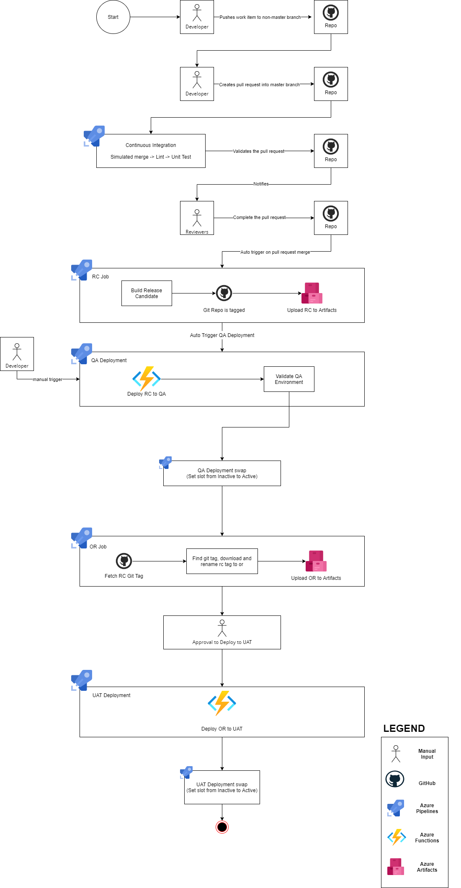

# Azure Pipeline Templates

## Architecture for new Azure Directory 

[Diagram Source](./Source/azure_architecture.jpg)

## Overview
- Each subdirectory is a category of Azure Pipeline templates
- There are two types in the Azure Directory (e.g. `services`, `shell_functions`)
  - `services`: contains templates and example values for Azure services
  - `shell Functions`: directory contains shell functions for Azure

- Inside services there are three categories: `applications`, `common`, and `platforms`
  - `applications`: templates that consume an existing service
  - `platforms`: templates that provide a new service 
  - `common`: agnostic templates that are common to both `applications` and `platforms` 

- Templates provided will also have a subdirectory called `tasks` which provides an action for the pipeline

## Terminology
- `stage`: Sequential unit within a pipeline
- `job`: Parallel task within a stage
- `step`: Sequential task within a job
- `extends`: links an existing template to another one (if called)  

## Templates
- Templates define sets of either stages, jobs, or steps

## Usage Conventions
- A `pipeline.yml` is placed in the app repo, does three things:
  - Defines git events for which to run the pipeline
  - Makes cloud-shell available to the pipeline
  - Calls one `template.yml` with app-specific parameters

## Template Parameters
- Evaluated at compile time
- Can be pipeline variables
- Accessed like: `${{ parameters.NAME }}`

## Pipeline Variables
- Evaluated differently depending on how you access them
  - `$(NAME)`: Returns the run-time (current) value
    - Evaluates to `$(NAME)` when undefined
  - `$[ variables.NAME ]`: Returns the run-time (current) value
    - Evaluates to an empty string when undefined
    - Used when creating conditional pipeline jobs, stages, or steps
  - `${{ variables.NAME }}`: Returns the compile-time (queue-time) value
    - Evaluates to an empty string when undefined
    - Can be used to set variables in templates
- Can be set at runtime by echoing a specially formatted text block
  - Like: `echo "##vso[task.setvariable variable=NAME]kevin"`
    - Sets the variable NAME to 'kevin' within the job

## Yaml Parameter Definitions

### Pre-Merge 

Simulated merge to lint, test, and build the project 

1. **mainBranch**: main github branch
1. **prBranch**: pull request branch
1. **gitUserEmail**: github user email
1. **gitUserName**: github username
1. **serviceName**: application name (e.g. `AccountService`)
1. **usersteps**: list of tasks that is executed 
1. **displayName**: caption being displayed when a specific stage, job, or task is running
1. **workingDirectory**: the working directory of the application 

### Release Candidate

Lints, test, and builds a release candidate artifact 

1. **artifactType**: the type of artifact being used (e.g. release candidate `rc` or official release `or`)
1. **artifactFeed**:  organizational constructs that stores, manage, and groups dependencies/packages
1. **sourceDirectory**: the path to the microservice (e.g. `./src/AccountService`)
1. **funcDirectory**: path to the api directory of the microservice (e.g. `./src/AccountService/AccountService.Api`)
1. **artifactName**: name of the artifact
1. **serviceName**: name of the application
1. **jobName**: name of the job that is being run (must be unique)
1. **displayName**: caption being displayed when a specific stage, job, or task is running (must be unique)
1. **tagsIncludeName**: boolean, `true` if it's a mono-repo, git will tag the version with it's application name `false` tag only the version

### Continuous Deployment

Deploys application 

1. **deploymentName**: name of the application during deployment (e.g. `AccountService`)
1. **environmentName**: name of the environment + repo associated (e.g. ``MimoFunctions-UAT`)
1. **dependsOn**: makes a task, job, or stage depend on another task, job, or stage
1. **condition**: sets condition for a task, job, or stage
1. **resourceGroup**: the azure resource group
1. **serviceConnection**: the azure service connection which enables external and remote services to execute tasks in a job 
1. **version**: artifact version 
1. **tagsIncludeName**: boolean, `true` if it's a mono-repo, git will tag the version with it's application name `false` tag only the version
1. **artifactType**:  the type of artifact being used (e.g. release candidate `rc` or official release `or`)
1. **artifactName**:  name of the artifact
1. **artifactFeed**: organizational constructs that stores, manage, and groups dependencies/packages
1. **deploymentSlot**: during the deployment phase, deployment slot is made and the application is set to inactive
1. **funcAppName**: name of the azure function application (e.g. `dte-mimo-accounts-qa`)
1. **funcAppSettings**: azure function app path to the environment variables 

### Deployment Swap 

Sets project from inactive to active

1. **deploymentName**: name of the application during deployment (e.g. `AccountService`)
1. **environmentName**: name of the environment + repo associated (e.g. `MimoFunctions-UAT`)
1. **condition**: sets condition for a task, job, or stage
1. **resourceGroup**: the azure resource group
1. **serviceConnection**:  the azure service connection which enables external and remote services to execute tasks in a job 
1. **slotToSetActive**: sets `deploymentSlot` to active
1. **funcAppName**: name of the azure function application (e.g. `dte-mimo-accounts-qa`)

### Official Release 

Creates a new official release 

1. **artifactType**: the type of artifact being used (e.g. release candidate `rc` or official release `or`)
1. **createFromExisting**: parameter if included then the pipeline will use an existing artifact vs using a new one 
1. **artifactFeed**: organizational constructs that stores, manage, and groups dependencies/packages
1. **sourceDirectory**: the path to the microservice (e.g. `./src/AccountService`)
1. **funcDirectory**: path to the api directory of the microservice (e.g. `./src/AccountService/AccountService.Api`)
1. **artifactName**: name of the artifact
1. **serviceName**: name of the application
1. **jobName**: name of the job that is being run (must be unique)
1. **displayName**: caption being displayed when a specific stage, job, or task is running (must be unique)
1. **tagsIncludeName**: boolean, `true` if it's a mono-repo, git will tag the version with it's application name `false` tag only the version

### Environment Variables Definitions for Platforms

1. **deploymentName**: name of the application during deployment (e.g. `AccountService`)
1. **environmentName**: name of the environment + repo associated (e.g. `MimoFunctions-UAT`)
1. **dependsOn**: makes a task, job, or stage depend on another task, job, or stage
1. **condition**: sets condition for a task, job, or stage
1. **resourceGroup**: the azure resource group
1. **serviceConnection**:  the azure service connection which enables external and remote services to execute tasks in a job 
1. **armTemplate**: directory to where the arm template is located
1. **armTemplateParams**: parameters to be included in the arm template 